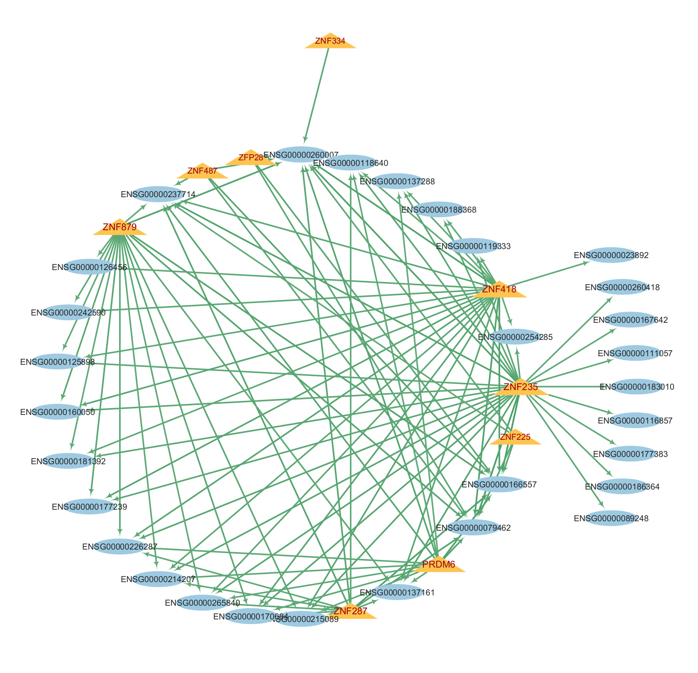
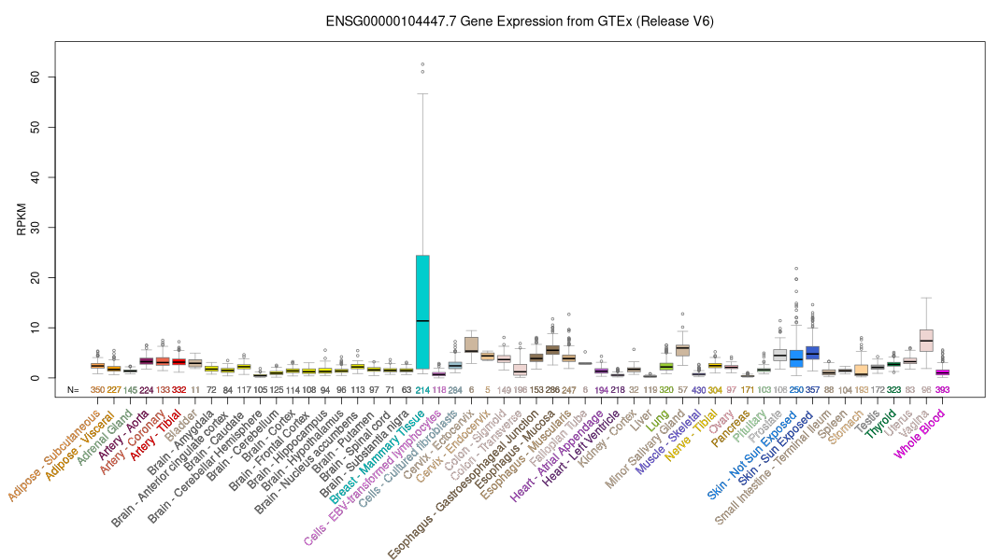

## step1 load data & Preprocessing

# 1. Load Library
=======
bibliography: references.bib
link-citations: true
output:
  pdf_document: default
  html_document: default
editor_options: 
  markdown: 
    wrap: 72
---

# Introduction

Breast cancer is currently the most frequently diagnosed malignancy
among women globally [@sung2021global]. Among its various subtypes,
Estrogen Receptor-positive (ER+) breast cancer is the most prevalent,
accounting for approximately 70% of all cases [@giuliano2024treating;
@siegel2024cancer]. This high incidence rate underscores the critical
need for transcriptomic studies to better understand the molecular
drivers of the ER+ phenotype.

Despite clinical advances, understanding the transition from healthy
mammary tissue to a malignant ER+ state requires a deep dive into the
transcriptome. This analysis integrates high-throughput RNA-sequencing
data from two large-scale and well-curated resources:**TCGA (The Cancer
Genome Atlas):** Representing the tumoral landscape of ER+ Breast
Carcinoma. **GTEx(Genotype-Tissue Expression):** Providing a robust
baseline of healthy, non-diseased breast tissue.

Identifying individual tumor-associated genes through differential
expression is useful, but it often misses the bigger picture: cancer is
fundamentally a systems-level failure of gene regulation. For ER+ breast
cancer, the defining features, such as aberrant estrogen signaling and
rapid proliferation, which are driven by complex transcription factor
networks. By shifting our focus from isolated gene counts to the
underlying regulatory architecture, we can better resolve the biological
complexities of hormone-dependent tumors.

**Objectives:** The primary goal of this study is to elucidate the
transcriptomic and regulatory landscapes that distinguish ER-positive
(ER+) breast carcinoma from healthy mammary tissue. By integrating
primary tumor data from TCGA with healthy baseline samples from GTEx, we
aim to provide a more robust comparison than traditional cancer-only
studies.

Together, these analyses seek to answer a fundamental research question:
What specific genes and regulatory networks distinguish ER+ tumor
tissues from truly healthy breast tissues (GTEx), and how does this
inform our understanding of hormone-driven carcinogenesis?

# Method

## load data & Preprocessing
The initial phase of our analysis focused on integrating and standardizing transcriptomic data from two primary sources to facilitate a robust comparison between malignant and healthy breast tissues.
```{r}
# 0. Load Library
# install.packages("BiocManager")
# BiocManager::install("SummarizedExperiment")
# BiocManager::install("edgeR")
library(SummarizedExperiment)
library(ggplot2)
library(ggrepel)
library(edgeR)
library(limma)
```

We utilized raw count matrices and metadata from the The Cancer Genome Atlas (TCGA) for tumor samples and the Genotype-Tissue Expression (GTEx) project for healthy control samples. We strictly filtered the TCGA cohort to include only ER-positive samples.


```{r}
# 1. Load Data
tcga_data <- readRDS(file.path("../data/tcga_brca.rds"))
tcga_counts <- assay(tcga_data)
tcga_meta <- as.data.frame(colData(tcga_data))

write.csv(tcga_counts, file.path("../output/TCGA_BRCA_Counts.csv"), row.names = TRUE)
write.csv(tcga_meta, file.path("../output/TCGA_BRCA_Metadata.csv"), row.names = TRUE)

gtex_data <- readRDS(file.path("../data/gtex_breast.rds"))
gtex_counts <- assay(gtex_data)
gtex_meta <- as.data.frame(colData(gtex_data))

write.csv(gtex_counts, file.path("../output/GTEx_Breast_Counts.csv"), row.names = TRUE)
write.csv(gtex_meta, file.path("../output/GTEx_Breast_Metadata.csv"), row.names = TRUE)
```

To ensure compatibility between the two datasets, we performed gene alignment by identifying the intersection of gene identifiers present in both TCGA and GTEx. Both matrices were subsetted to include only these common genes and then merged into a unified raw counts matrix. 

```{r}
# 2. Filter ER+ samples
grep("estrogen", colnames(tcga_meta), value = TRUE, ignore.case = TRUE)

target_col <- "tcga.xml_breast_carcinoma_estrogen_receptor_status"
table(tcga_meta[[target_col]])
er_pos_ids <- which(tcga_meta[[target_col]] == "Positive")
tcga_counts_ER_ONLY <- tcga_counts[, er_pos_ids]
```

```{r}
# 3. Align genes
genes_tcga <- rownames(tcga_counts_ER_ONLY)
genes_gtex <- rownames(gtex_counts)

common_genes <- intersect(genes_tcga, genes_gtex)
print(paste("TCGA:", length(genes_tcga)))
print(paste("GTEx:", length(genes_gtex)))
print(paste("common:", length(common_genes)))
```

```{r}
# 4. Subset and order both matrices by common genes
tcga_aligned <- tcga_counts_ER_ONLY[common_genes, ]
gtex_aligned <- gtex_counts[common_genes, ]

final_counts_matrix <- cbind(tcga_aligned, gtex_aligned)
write.csv(final_counts_matrix, file.path("../output/Final_ERpos_Tumor_vs_Normal_Counts.csv"))
print(paste("Dimensions:",nrow(final_counts_matrix),"genes x", ncol(final_counts_matrix), "samples"))
```

To improve statistical power and reduce stochastic noise, we implemented a rigorous "Low-Count Filtering" protocol. We first calculated Counts Per Million (CPM) to normalize for differences in library size across samples. Genes were retained in the final dataset only if they exhibited a expression level of CPM > 1 in at least 25% of the total samples.

This strategy eliminates genes with very low or sporadic expression that could otherwise bias variance estimates during differential expression analysis.

This filtering process significantly refined our dataset, reducing it to approximately half of its original size while preserving high-quality, biologically relevant signals for downstream analysis.

```{r}
# 5. Low Count Filtering
print(nrow(final_counts_matrix))

library_sizes <- colSums(final_counts_matrix)
cpm_matrix <- t(t(final_counts_matrix) / library_sizes) * 1e6

min_samples <- ncol(final_counts_matrix) / 4
keep <- rowSums(cpm_matrix > 1) >= min_samples

final_counts_filtered <- final_counts_matrix[keep, ]

print(paste("Total genes AFTER filtering:", nrow(final_counts_filtered)))
print(paste("Removed:", nrow(final_counts_matrix) - nrow(final_counts_filtered), "noisy genes."))

write.csv(final_counts_filtered, file.path("../output/Filtered_Final_ERpos_Tumor_vs_Normal_Counts.csv"), row.names = TRUE)

dim(final_counts_filtered)
```

## Exploratory data analysis (PCA)

### PCA

Following the data cleaning step, we performed principal component
analysis (PCA) on the normalized expression matrix to explore global
transcriptional differences between ER-positive breast tumor samples and
normal breast tissues

Before performing PCA, we first preprocessed the RNA-seq data to make
the samples suitable for downstream analysis. We normalized the raw
RNA-seq counts to counts per million (CPM)using sample-specific library
sizes to account for differences in sequencing depth across samples. We
then applied a log transformation to the normalized data, adding a
constant of one so that genes with zero counts could be included. This
transformation reduces the influence of highly expressed genes and helps
stabilize variance across genes, allowing PCA to better capture
meaningful global expression patterns

```{r}
# 1. CPM normalization and log transformß
library_sizes <- colSums(final_counts_filtered)

cpm_matrix <- t(t(final_counts_filtered) / library_sizes) * 1e6
logcpm_matrix <- log2(cpm_matrix + 1)
```

Here the scores for the first two principal components were extracted
and combined with sample group labels to facilitate downstream analysis.
Group-wise centroids were calculated to summarize the average position
of ER-positive tumor and normal samples in the reduced-dimensional
space, and the proportion of variance explained by each principal
component was computed to quantify their contribution to overall
expression variability

```{r}
# 2. PCA


pca_res <- prcomp(t(logcpm_matrix), scale. = TRUE)

#df
pca_df <- data.frame(
  PC1 = pca_res$x[, 1],
  PC2 = pca_res$x[, 2],
  Group = factor(c(
    rep("ER+ Tumor", ncol(tcga_aligned)),
    rep("Normal", ncol(gtex_aligned))
  ))
)

# centroids 
centroids <- aggregate(cbind(PC1, PC2) ~ Group, data = pca_df, mean)


var_exp <- round(100 * summary(pca_res)$importance[2, 1:2], 1)
```

# Plot
Here are our PCA results. The bar plot summarizes the proportion of
total variance in the log-CPM expression matrix explained by each of the
top 10 principal components. PC1 captures the largest source of
variation in the dataset, explaining 26% of the total variance, while
PC2 explains an additional 10%

```{r}
# Plot1

pca_var <- data.frame(
  PC = paste0("PC", seq_along(pca_res$sdev)),
  Variance = (pca_res$sdev^2) / sum(pca_res$sdev^2) * 100
)

# Select top 10 PCs
pca_var_top <- pca_var[1:10, ]

ggplot(pca_var_top, aes(x = reorder(PC, -Variance), y = Variance)) +
  geom_bar(stat = "identity", fill = "#4C72B0", width = 0.8) +
  geom_text(
    aes(label = paste0(round(Variance, 1), "%")),
    vjust = -0.4,
    size = 4
  ) +
  labs(
    title = "Variance Explained by Principal Components",
    x = "Principal Component",
    y = "Variance Explained (%)"
  ) +
  theme_classic(base_size = 16) +
  theme(
    plot.title = element_text(face = "bold"),
    axis.text.x = element_text(angle = 45, hjust = 1)
  )

```

Here is the PCA scatter plot showing samples projected onto the first
two principal components, with points colored by biological group. A
clear separation between ER-positive tumor samples and normal breast
tissues is observed primarily along PC1, indicating that disease status
is a major driver of global gene expression variation. In addition,
tumor samples display greater dispersion, particularly along PC2,
reflecting increased transcriptional heterogeneity in ER-positive tumors
compared to normal tissue.

```{r}
# Plot2
ggplot(pca_df, aes(x = PC1, y = PC2, color = Group)) +
  geom_point(alpha = 0.6, size = 2) +
  geom_label_repel(
    data = centroids,
    aes(x = PC1, y = PC2, label = Group),
    inherit.aes = FALSE,
    fontface = "bold",
    size = 5
  ) +
  scale_color_manual(values = c("ER+ Tumor" = "#E76F51", "Normal" = "#2A9D8F")) +
  labs(
    title = "PCA of ER+ Tumor vs Normal Samples",
    x = paste0("PC1 (", var_exp[1], "%)"),
    y = paste0("PC2 (", var_exp[2], "%)")
  ) +
  theme_classic(base_size = 16) +
  theme(legend.position = "right")
```


While PCA reveals clear global differences between ER-positive tumor and
normal samples, it does not identify which specific genes are
responsible for this separation. Therefore, the next step is
differential expression analysis, which allows us to systematically
identify genes whose expression levels differ significantly between the
two conditions and drive the observed transcriptomic differences.

### Differential Expression Analysis

We already remove the genes with low counts in the preprocessing step
according to the criteria: dropped if they have very low counts (1cpm)
in 25% of the samples. This step reduces noise introduced by genes that
are unlikely to be reliably measured or biologically informative and
ensures that downstream analyses focus on genes with sufficient
expression to support meaningful differential expression and regulatory
inference.

To assess the mean–variance relationship in the raw RNA-seq data, we
calculated the gene-wise mean expression and standard deviation directly
from the filtered count matrix and visualized their relationship.

The resulting plot shows a strong positive association, with genes
exhibiting higher average expression also displaying substantially
larger variance. This heteroscedasticity violates the constant-variance
assumption underlying linear modeling approaches

```{r}
# 1. mean-variance relationship
gene_sd   <- apply(final_counts_filtered, 1, sd)
gene_mean <- apply(final_counts_filtered, 1, mean)

plot(
  x = gene_mean,
  y = gene_sd,
  pch = 16,
  cex = 0.4,
  main = "Raw counts: variance depends on mean",
  xlab = "Mean expression",
  ylab = "Standard deviation"
)
```

To address this issue and enable valid differential expression analysis,
we subsequently applied the voom transformation, which models and
corrects the mean–variance relationship, resulting in a smoother and
more stable variance structure suitable for linear modeling

```{r}
# 2. Voom Transformation
group <- factor(
  c(
    rep("ER+ Tumor", ncol(tcga_aligned)),
    rep("Normal", ncol(gtex_aligned))
  )
)

design <- model.matrix(~ group)

dge <- DGEList(counts = final_counts_filtered)
dge <- calcNormFactors(dge)

voom_out <- voom(dge, design, plot = TRUE)
```

After applying the voom transformation, we fitted a gene-wise linear
model using the limma framework to compare ER-positive tumor and normal
samples. Empirical Bayes moderation was then applied to stabilize
variance estimates across genes by borrowing information from the full
dataset. The resulting diagnostic plot shows that variance is
approximately constant across expression levels, indicating that model
assumptions are satisfied and that the data are appropriately
conditioned for reliable differential expression testing

```{r}
# 3. Linear model + Bayes
fit <- lmFit(voom_out, design)
fit <- eBayes(fit)

plotSA(
  fit,
  main = "Final model mean–variance trend"
)
```

Differential expression results were extracted from the fitted linear
model using the topTable function, specifying the contrast between
normal and ER-positive tumor samples. For each gene, this step reports
the estimated log2 fold change, moderated test statistics, and
associated p-values, with multiple-testing correction applied using the
Benjamini–Hochberg false discovery rate method. The resulting table
provides a ranked list of genes based on statistical evidence for
differential expression and serves as the basis for downstream filtering
and biological interpretation


```{r}
res <- topTable(fit, coef = "groupNormal", number = Inf, adjust.method = "BH")
head(res)

```

## Visualization and Enrichment Analysis


### Explore the DE results

We first summarized the number of differentially expressed (DE) genes
between ER+ tumor (TCGA) and normal breast tissue (GTEx) using a
stringent cutoff of FDR \< 0.05 and \|log2 fold-change\| \> 2. Under
this threshold, we identified **3106** DE genes in total.

Because the model coefficient is defined as **log2FC = (Normal −
Tumor)**, genes with **negative log2FC** are higher in **ER+ tumor**,
while genes with **positive log2FC** are higher in **normal** tissue.
Using this convention, **1325 genes** are upregulated in **ER+ tumor**
(log2FC \< −2) and **1781 genes** are upregulated in **normal** tissue
(log2FC \> 2).

Overall, this indicates widespread transcriptional differences between
ER+ breast tumors and normal breast tissue, motivating downstream
visualization (volcano/MA plots and heatmaps) and pathway-level
enrichment analyses to interpret these changes at the level of
biological programs.

```{r}
de_all_idx  <- res$adj.P.Val < 0.05 & abs(res$logFC) > 2
n_de_all    <- sum(de_all_idx)

tumor_up_idx  <- res$adj.P.Val < 0.05 & res$logFC < -2
n_tumor_up    <- sum(tumor_up_idx)

normal_up_idx <- res$adj.P.Val < 0.05 & res$logFC >  2
n_normal_up   <- sum(normal_up_idx)

cat("Total DE genes (FDR < 0.05 and |log2FC| > 2):", n_de_all, "\n")
cat("Up in ER+ Tumor (logFC < -2):", n_tumor_up, "\n")
cat("Up in Normal (logFC > 2):", n_normal_up, "\n")
```

### Volcano Plot
We next visualized the DE results using a volcano plot.

```{r}
plot_df <- data.frame(
  logFC = res$logFC,
  negLogFDR = -log10(res$adj.P.Val)
)

plot_df$threshold <- "Not significant"
plot_df$threshold[res$adj.P.Val < 0.05 & res$logFC > 2] <- "Up in Normal"
plot_df$threshold[res$adj.P.Val < 0.05 & res$logFC < -2] <- "Up in Tumor"

ggplot(plot_df, aes(x = logFC, y = negLogFDR, color = threshold)) +
  geom_point(alpha = 0.6, size = 1.2) +
  scale_color_manual(
    values = c(
      "Up in Tumor" = "#E67E22",
      "Up in Normal" = "#2980B9",
      "Not significant" = "grey70"
    )
  ) +
  labs(
    title = "Volcano Plot: ER+ Tumor vs Normal",
    x = "log2 Fold Change (Normal - Tumor)",
    y = "-log10(FDR)"
  ) +
  theme_classic(base_size = 15)
```
The volcano plot summarizes differential expression results by
simultaneously displaying effect size and statistical significance. Each
point represents one gene, with the x-axis showing the log2 fold change
(Normal − Tumor) and the y-axis showing −log10(FDR). Genes farther from
zero on the x-axis exhibit larger expression differences, while genes
higher on the y-axis are more statistically significant.

Using a cutoff of FDR \< 0.05 and \|log2 fold-change\| \> 2, genes
upregulated in ER+ tumor tissue (log2FC \< −2) are highlighted in
orange, whereas genes upregulated in normal breast tissue (log2FC \> 2)
are shown in blue. Genes that do not meet these thresholds are shown in
grey.

The plot reveals a large number of highly significant genes on both
sides of the distribution, indicating strong transcriptional differences
between ER+ breast tumors and normal tissue. Notably, many
tumor-upregulated genes exhibit both large effect sizes and extremely
low FDR values, consistent with widespread activation of
tumor-associated transcriptional programs.

A horizontal band of points is observed at the top of the volcano plot,
corresponding to genes with extremely small adjusted p-values. For these
genes, the FDR values are numerically close to zero due to very strong
statistical evidence, causing −log10(FDR) to approach infinity. This
behavior is expected in large RNA-seq datasets with high statistical
power and does not affect the interpretation of differential expression
patterns.

These patterns motivate downstream pathway-level analyses to determine
which biological processes drive the observed expression changes.

### MA Plot

We additionally used an MA plot to visualize log2 fold-changes as a
function of average expression. This plot helps assess whether large
fold-changes are concentrated among lowly expressed genes (which can be
noisier) and whether the overall distribution of changes is centered
around zero.

```{r}
ma_df <- data.frame(
  AveExpr = res$AveExpr,
  logFC   = res$logFC,
  adjP    = res$adj.P.Val
)

ma_df$threshold <- "Not significant"
ma_df$threshold[ma_df$adjP < 0.05 & ma_df$logFC > 2]  <- "Up in Normal"
ma_df$threshold[ma_df$adjP < 0.05 & ma_df$logFC < -2] <- "Up in Tumor"

ggplot(ma_df, aes(x = AveExpr, y = logFC, color = threshold)) +
  geom_point(alpha = 0.5, size = 1.2) +
  scale_color_manual(
    values = c(
      "Up in Tumor" = "#E67E22",
      "Up in Normal" = "#2980B9",
      "Not significant" = "grey70"
    )
  ) +
  labs(
    title = "MA Plot: ER+ Tumor vs Normal",
    x = "Average log-expression",
    y = "log2 Fold Change (Normal - Tumor)"
  ) +
  theme_classic(base_size = 15)
```
The MA plot displays the relationship between gene expression abundance
and differential expression. Each point represents one gene, with the
x-axis showing the average log-expression across all samples and the
y-axis showing the log2 fold change (Normal − Tumor).

Genes significantly upregulated in normal tissue (FDR \< 0.05 and log2FC
\> 2) are shown in blue, while genes upregulated in ER+ tumor tissue
(FDR \< 0.05 and log2FC \< −2) are shown in orange. Non-significant
genes are shown in grey.

Most genes with low average expression cluster tightly around log2 fold
change near zero, reflecting higher variability and lower statistical
power at low expression levels. In contrast, highly expressed genes show
more stable fold-change estimates, with many exhibiting consistent
upregulation in either tumor or normal tissue. The approximately
symmetric distribution of fold changes around zero indicates balanced
transcriptional shifts between the two conditions rather than a global
expression bias.

Overall, the MA plot confirms that the observed differential expression
patterns are not driven solely by low-abundance genes and supports the
robustness of the differential expression analysis.

### Heatmap

To further examine whether the most significant DE genes show consistent
expression patterns across samples, we plotted a heatmap of the top 20
genes ranked by adjusted p-value.

```{r}
library(gplots)

res_ordered <- res[order(res$adj.P.Val), ]
top_n <- 20
top_genes <- rownames(res_ordered)[1:top_n]

mat <- logcpm_matrix[top_genes, ]
cols_group <- c(
  rep("ER+ Tumor", ncol(tcga_aligned)),
  rep("Normal",    ncol(gtex_aligned))
)
heatmapColColors <- c("ER+ Tumor" = "red", "Normal" = "blue")[cols_group]
heatmapCols <- colorRampPalette(c("yellow", "red"))(250)

heatmap.2(
  mat,
  scale = "row",
  trace = "none",
  ColSideColors = heatmapColColors,
  col = heatmapCols,
  labCol = FALSE,
  margins = c(5, 10),
  density.info = "none",
  key.xlab = "Row-scaled expression",
  key.title = NA,
  main = "Top 20 DE genes: ER+ Tumor vs Normal"
)

legend(
  "topright",
  legend = c("ER+ Tumor", "Normal"),
  inset = c(-0.07, 0),
  fill   = c("red", "blue"),
  border = NA,
  bty = "n",
  xpd = TRUE
)
```

Genes were ranked by adjusted p-value, and the top 20 were selected
without applying an additional fold-change filter. Expression values
were logCPM-transformed and scaled by row so that colors represent
relative expression differences across samples for each gene.

Despite gene labels initially being Ensembl gene IDs, the heatmap
reveals a clear separation between ER+ tumor and normal breast samples.
Samples largely cluster by condition, indicating that the most
statistically significant differentially expressed genes consistently
distinguish tumor from normal tissue.

Across these genes, expression patterns are highly coordinated. Many
genes show elevated expression in ER+ tumor samples with lower
expression in normal samples, while others display the opposite pattern.
This consistent structure suggests that the observed differential
expression reflects underlying biological differences rather than random
variation.

```{r}

library(biomaRt)

top_genes_stripped <- sub("\\..*", "", top_genes)
ensembl <- useMart("ensembl", dataset = "hsapiens_gene_ensembl")
annot <- getBM(
  attributes = c("ensembl_gene_id", "hgnc_symbol"),
  filters    = "ensembl_gene_id",
  values     = top_genes_stripped,
  mart       = ensembl
)

symbols <- annot$hgnc_symbol[match(top_genes_stripped, annot$ensembl_gene_id)]
symbols[symbols == "" | is.na(symbols)] <- top_genes[symbols == "" | is.na(symbols)]

rownames(mat) <- symbols

heatmapCols <- colorRampPalette(c("yellow", "red"))(250)

heatmap.2(
  mat,
  scale = "row",
  trace = "none",
  ColSideColors = heatmapColColors,
  col = heatmapCols,
  labCol = FALSE,
  margins = c(5, 10),
  density.info = "none",
  key.xlab = "Row-scaled expression",
  key.title = NA,
  main = "Top 20 DE genes: ER+ Tumor vs Normal"
)

legend(
  "topright",
  inset = c(-0.07, 0),
  legend = c("ER+ Tumor", "Normal"),
  fill   = c("red", "blue"),
  border = NA,
  bty = "n",
  xpd = TRUE
)
```

To improve interpretability, Ensembl gene IDs were mapped to HGNC gene
symbols using the biomaRt database. Version suffixes were removed from
Ensembl IDs prior to annotation to ensure proper matching. For genes
without an available HGNC symbol, the original Ensembl IDs were
retained.

Replacing Ensembl IDs with gene symbols does not alter the expression
data or clustering structure of the heatmap; rather, it facilitates
biological interpretation by allowing known genes and pathways to be
more readily recognized. The persistence of distinct tumor–normal
expression patterns after annotation confirms that the observed
structure is driven by expression differences and not by labeling
artifacts.

Overall, the heatmap shows that these top DE genes separate ER+ tumor
and normal samples into distinct clusters, indicating that the strongest
DE signals are coherent across many samples rather than driven by a
small subset of outliers and motivating subsequent pathway-level
enrichment analyses to identify the biological programs underlying these
gene-level differences.

### Hallmark Gene Set Enrichment Analysis (GSEA)

We first prepare gene identifiers for downstream Hallmark GSEA. The
differential expression results `res` are indexed by Ensembl gene IDs
(e.g., `ENSG00000...`), often including a version suffix (e.g., `.5`).
Because many enrichment tools and gene set databases (including MSigDB
collections accessed via `msigdbr`) commonly use Entrez gene IDs, we
first map Ensembl IDs to Entrez IDs.

Specifically, we remove the version suffix from Ensembl IDs
(`sub("\\..*", "", ...)`) to ensure stable matching. We then query the
Ensembl BioMart database (`biomaRt`) for an annotation table linking
each Ensembl gene ID to its corresponding Entrez gene ID. The resulting
mapping (`annot`) will be used to convert our ranked gene list into
Entrez space before running Hallmark GSEA.

```{r}
library(biomaRt)
library(clusterProfiler)
library(msigdbr)
library(dplyr)

ensembl_ids <- sub("\\..*", "", rownames(res))
ensembl <- useMart("ensembl", dataset = "hsapiens_gene_ensembl")

annot <- getBM(
  attributes = c("ensembl_gene_id", "entrezgene_id"),
  filters    = "ensembl_gene_id",
  values     = ensembl_ids,
  mart       = ensembl
)

head(annot)
```
Then we construct the **ranked gene list** required for preranked
GSEA.\\ 1) We start from the limma output table `res` and create a
version-stripped Ensembl ID column (`ensembl_nover`) so it matches the
BioMart annotation keys.\\ 2) We then merge the differential expression
results with the Ensembl→Entrez mapping table `annot`, and remove genes
without an Entrez ID (`NA`), since Hallmark gene sets are indexed by
Entrez IDs.\\ 3) Because multiple Ensembl IDs can map to the same Entrez
gene ID, we collapse duplicates by keeping one representative row per
Entrez ID. Here we keep the entry with the largest absolute t-statistic
(i.e., strongest evidence of differential expression), using: -
`arrange(entrezgene_id, desc(abs(t)))` to put the strongest row first
within each Entrez ID, and - `distinct(entrezgene_id, .keep_all = TRUE)`
to keep only that top row.\\ 4) Finally, we create the preranked vector
`gene_list`, where: - the values are the limma t-statistics
(`res_gsea$t`) representing signed strength of differential expression,
and - the names are the corresponding Entrez gene IDs.\\ We sort this
vector in decreasing order so that genes most positively associated with
the contrast appear at the top, which is the expected input format for
GSEA.\\

Note: the sign of the t-statistic follows the model contrast used in
`topTable()`. In our analysis we extracted `coef = "groupNormal"`, so
positive t (and positive logFC) indicates higher expression in Normal
relative to ER+ Tumor, while negative values indicate higher expression
in ER+ Tumor.

```{r}
res_gsea <- res
res_gsea$ensembl_nover <- sub("\\..*", "", rownames(res_gsea))

res_gsea <- merge(
  res_gsea,
  annot,
  by.x = "ensembl_nover",
  by.y = "ensembl_gene_id"
)

res_gsea <- res_gsea[!is.na(res_gsea$entrezgene_id), ]

res_gsea <- res_gsea %>%
  arrange(entrezgene_id, desc(abs(t))) %>%
  distinct(entrezgene_id, .keep_all = TRUE)

gene_list <- res_gsea$t
names(gene_list) <- res_gsea$entrezgene_id

gene_list <- sort(gene_list, decreasing = TRUE)
```

To interpret differential expression results at the pathway level, we
performed Gene Set Enrichment Analysis (GSEA) using the MSigDB Hallmark
gene sets. Unlike over-representation analysis that depends on an
arbitrary DE cutoff, GSEA uses the entire ranked gene list (here ranked
by the limma moderated t-statistic) to test whether genes from a pathway
tend to accumulate near the top or bottom of the ranked list. We used
the msigdbr package to retrieve Hallmark gene sets and ran
clusterProfiler::GSEA with FDR control to identify pathways
systematically enriched toward either the ER+ tumor side or the normal
side.

```{r}
m_df <- msigdbr(species = "Homo sapiens", category = "H")

hallmark_term2gene <- m_df %>%
  dplyr::select(gs_name, entrez_gene) %>%
  distinct()

set.seed(42)
gsea_hallmark <- GSEA(
  geneList     = gene_list,
  TERM2GENE    = hallmark_term2gene,
  pvalueCutoff = 0.05,
  verbose      = FALSE
)

gsea_hallmark_res <- as.data.frame(gsea_hallmark)
head(gsea_hallmark_res)
```

Each row in the GSEA result corresponds to one Hallmark pathway. setSize
is the number of genes from that pathway that overlap with our ranked
gene list. The key statistic is the normalized enrichment score (NES),
which summarizes the strength and direction of enrichment. Statistical
significance is assessed after multiple-testing correction using
p.adjust (BH-FDR). The core_enrichment column lists the “leading-edge”
genes (Entrez IDs) that contribute most to the enrichment signal for
each pathway and can be mapped back to gene symbols for follow-up
interpretation.

After performing Hallmark GSEA, we further categorized significantly
enriched pathways based on the direction of enrichment. Because the
ranked gene list was ordered by decreasing t-statistics for the (Normal
− Tumor) contrast, pathways with negative normalized enrichment scores
(NES \< 0) are enriched toward genes upregulated in ER+ tumors, whereas
pathways with positive NES (NES \> 0) are enriched toward genes
upregulated in normal breast tissue. We therefore separated Hallmark
pathways into tumor-enriched and normal-enriched groups and ranked them
by adjusted p-values to highlight the most strongly associated
biological programs.

```{r}
gsea_hallmark_res <- as.data.frame(gsea_hallmark)

# Tumor enriched (NES < 0)
tumor_top <- gsea_hallmark_res[gsea_hallmark_res$NES < 0, ]
tumor_top <- tumor_top[order(tumor_top$p.adjust), ]
head(tumor_top[, c("ID","NES","p.adjust")], 10)

# Normal enriched (NES > 0)
normal_top <- gsea_hallmark_res[gsea_hallmark_res$NES > 0, ]
normal_top <- normal_top[order(normal_top$p.adjust), ]
head(normal_top[, c("ID","NES","p.adjust")], 10)
```

To summarize and compare the most prominent biological programs
associated with ER+ tumors and normal breast tissue, we visualized the
top Hallmark gene sets identified by Gene Set Enrichment Analysis
(GSEA).

Specifically, we selected the top enriched Hallmark pathways on each
side—those with the most negative normalized enrichment scores (NES),
indicating enrichment in ER+ tumor samples, and those with the most
positive NES, indicating enrichment in normal tissue. These pathways
were ranked by adjusted p-value, and the top ten from each group were
displayed to highlight dominant, condition-specific transcriptional
programs.

```{r}
library(ggplot2)

top_show <- rbind(
  head(tumor_top, 10),
  head(normal_top, 10)
)

top_show$ID <- factor(top_show$ID, levels = top_show$ID[order(top_show$NES)])

ggplot(top_show, aes(x = ID, y = NES)) +
  geom_col() +
  coord_flip() +
  labs(title = "Hallmark GSEA (ER+ Tumor vs Normal)",
       x = NULL, y = "NES (negative = ER+ Tumor enriched)") +
  theme_classic(base_size = 12)
```
The bar plot illustrates a clear functional contrast between ER+ tumors
and normal breast tissue at the pathway level. Hallmark gene sets with
strongly negative NES values are enriched in ER+ tumors, whereas those
with positive NES values are enriched in normal samples.

ER+ tumors show strong enrichment of cell cycle–related and
proliferative pathways, including G2M checkpoint, E2F targets, and MYC
targets, indicating increased cell division and dysregulated growth
control. In addition, pathways such as mTORC1 signaling, glycolysis, and
oxidative phosphorylation suggest metabolic reprogramming that supports
rapid proliferation and biosynthetic demand in tumor cells. The
enrichment of estrogen response (early and late) pathways further
reflects the hormone-driven nature of ER+ breast cancer.

In contrast, normal breast tissue is enriched for pathways related to
tissue structure and homeostasis, including myogenesis, apical junction,
and adipogenesis, which are consistent with normal differentiation and
cellular organization. Enrichment of TNFα signaling via NF-κB, hypoxia,
and immune-related signaling suggests intact stress-response and immune
surveillance mechanisms in non-tumor tissue.

Overall, these results demonstrate that ER+ tumors are characterized by
heightened proliferative, metabolic, and hormone-responsive programs,
while normal tissue exhibits pathways associated with structural
integrity, differentiation, and physiological signaling. This
pathway-level analysis complements the gene-level differential
expression results and highlights coordinated biological processes
underlying tumor–normal differences.

We also visualize each GSEA enrichment plot that shows how genes from a
specific Hallmark gene set are distributed along the ranked gene list.
The green curve represents the running enrichment score (ES), black
vertical bars indicate the positions of genes from the gene set in the
ranked list, and the bottom panel shows the ranking metric used to order
genes. A negative normalized enrichment score (NES) indicates enrichment
toward the ER+ tumor end of the ranked list, while a positive NES
indicates enrichment toward the normal tissue end.

```{r}
library(enrichplot)

gseaplot2(gsea_hallmark, "HALLMARK_G2M_CHECKPOINT", title ="G2M checkpoint" )
gseaplot2(gsea_hallmark, "HALLMARK_E2F_TARGETS", title = "E2F targets")
gseaplot2(gsea_hallmark, "HALLMARK_ESTROGEN_RESPONSE_EARLY", title = "estrogen response early")
```

**HALLMARK_G2M_CHECKPOINT** The G2M checkpoint gene set shows strong
negative enrichment (NES \< 0), indicating that G2M-related genes are
concentrated toward the ER+ tumor end of the ranked gene list. The
running enrichment score reaches its most negative value near the
tumor-associated genes, with a high density of gene set members
appearing late in the ranked list.

Biologically, this suggests enhanced cell cycle progression and
increased proliferative activity in ER+ tumor samples. Dysregulation of
the G2/M checkpoint is a hallmark of cancer, reflecting uncontrolled
cell division and genomic instability, which are consistent with
aggressive tumor growth.

**HALLMARK_E2F_TARGETS** The E2F target gene set also exhibits strong
negative enrichment, with most E2F-regulated genes clustered toward the
ER+ tumor end of the ranked list. The smooth and sustained decrease in
the running enrichment score indicates coordinated upregulation of E2F
target genes in tumor samples.

E2F transcription factors play a central role in regulating genes
required for DNA replication and cell cycle progression. Enrichment of
E2F targets in ER+ tumors suggests activation of proliferative
transcriptional programs, reinforcing the observation that tumor samples
are characterized by heightened cell cycle activity.

**HALLMARK_ESTROGEN_RESPONSE_EARLY** The estrogen response early gene
set shows significant negative enrichment, indicating that
estrogen-responsive genes are preferentially upregulated in ER+ tumor
samples. Gene set members are broadly distributed but skewed toward the
tumor-associated portion of the ranked list, producing a negative
enrichment score.

This pattern is biologically consistent with the estrogen
receptor–positive (ER+) subtype of breast cancer, where estrogen
signaling is a primary driver of tumor growth. Enrichment of early
estrogen response genes reflects active hormone-dependent
transcriptional regulation in ER+ tumors.

## PANDA network analysis

### Prepare expression datasets for PANDA network analysis

Current expression data is using version-stripped Ensembl gene names. To
match gene names in the motif-TF and protein-protein interaction files,
we need to remove the versions.

```{r}
# Remove Ensembl gene name versions
rownames(logcpm_matrix) <- sub("\\..*$", "", rownames(logcpm_matrix))
```

We will construct separate networks for cancer (ER+) data from TCGA-BRCA
and normal breast tissue data from GTEx. To achieve this goal, we
outputed two expression datasets that can be used by PANDA analysis
directly.

```{r}
# Separate cancer (ER+) and normal sets (filtered & normalized)

n_tcga <- ncol(tcga_aligned)
n_gtex <- ncol(gtex_aligned)

sample_group <- factor(
  c(
    rep("Tumor",  n_tcga),
    rep("Normal", n_gtex)
  )
)

table(sample_group)

expr_tumor <- logcpm_matrix[, sample_group == "Tumor"]
expr_normal <- logcpm_matrix[, sample_group == "Normal"]

dim(expr_tumor)
dim(expr_normal)


write.table(expr_tumor, file = "../output/tcga_brca_expr_ERpos_tumor_filtered_logcpm.txt",
  sep = "\t", quote = FALSE, row.names = TRUE, col.names = NA)

write.table(expr_normal, file = "../output/gtex_breast_expr_normal_filtered_logcpm.txt",
  sep = "\t", quote = FALSE, row.names = TRUE, col.names = NA)

```


### Implement PANDA Analysis

To map how gene regulation shifts in ER+ breast cancer, we constructed two condition-specific PANDA regulatory networks: one from normal breast tissue and one from ER+ tumor tissue. PANDA integrates gene expression, transcription factor binding motifs, and protein–protein interaction information to infer regulatory edge weights between transcription factors and their target genes.

Below are the sample codes that we planed to run for PANDA network analysis. However, considering the computational cost of building huge PANDA networks, we ran PANDA in high-performance environment command line accessed from HUIT Open OnDemand platform.


```{r fig:panda_multi_1, echo=FALSE, fig.cap="PANDA Analyis for ER+ Tumor Implemented on HUIT OnDemand Command", fig.show="hold"}
knitr::include_graphics("../images/panda_command_ERpos_tumor.png")
```

```{r fig:panda_multi_2, echo=FALSE, fig.cap="PANDA Analyis for ER+ Tumor Implemented on HUIT OnDemand Command (Continued)", fig.show="hold"}
knitr::include_graphics(
  "../images/panda_command_ERpos_tumor_cont.png")
```

```{r fig:panda_multi_3, echo=FALSE, fig.cap="PANDA Analyis for Normal Samples Implemented on HUIT OnDemand Command", fig.show="hold"}
knitr::include_graphics(
  "../images/panda_command_normal.png")
```

```{r fig:panda_multi_4, echo=FALSE, fig.cap="PANDA Analyis for Normal Sampled Implemented on HUIT OnDemand Command (Continued)", fig.show="hold"}
knitr::include_graphics(
  "../images/panda_command_normal_cont.png")
```
Below is the R code for data preprocessing and running PANDA. Since running PANDA locally is very constricted by computation power, in the R version we selected the top 10,000 genes that explained the most variance. In the following regulatory network analysis, we used the output from the HUIT for completeness of dataset.

Below is the R code for preprocessing data for PANDA. Due to the constraint in computation power, we selected the top 10,000 genes that can explain the most variance. In the subsequent analysis, we used the output from the complete dataset run in HUIT.

```{r}
#install and load necessary packages

# install.packages("devtools")
library(devtools)
# devtools::install_github("netZoo/netZooR", build_vignettes = FALSE)
# eNamespace("BiocManager", quietly = TRUE)  
#    install.packages("BiocManager",repos = "http://cran.us.r-project.org")  
# BiocManager::install("fgsea")   
#install.packages("ggplot2")  
#install.packages("reshape2")
#install.packages("visNetwork")

library(tibble)
library(netZooR)
library(fgsea)
library(ggplot2)
library(reshape2)
library('visNetwork') # for network visualization
```


```{r}
# load ppi and motif data
ppi <- read.table("../data/ppi_997TFs.txt")
motif <- read.table("../data/motif_997TFs_ensembl.txt")

expr_normal <- as.data.frame(expr_normal)
expr_tumor <- as.data.frame(expr_tumor)

#select the top genes with most variance
gene_vars_normal <- apply(expr_normal, 1, var)
gene_vars_tumor <- apply(expr_tumor, 1, var)
n_genes <- 10000

top_genes_normal <- names(sort(gene_vars_normal, decreasing = TRUE))[1:n_genes]
top_genes_tumor <- names(sort(gene_vars_tumor, decreasing = TRUE))[1:n_genes]

expr_normal_top <- expr_normal[top_genes_normal, ]
expr_tumor_top <- expr_tumor[top_genes_tumor, ]
```

```{r}

#mapping ensemble names to gene names

library(AnnotationDbi)
library(org.Hs.eg.db)


ens_ids_normal <- rownames(expr_normal_top)

mapping_normal <- mapIds(org.Hs.eg.db,
                  keys = ens_ids_normal,
                  column = "SYMBOL",
                  keytype = "ENSEMBL",
                  multiVals = "first")

expr_normal_top$Symbol <- mapping_normal

expr_clean_normal <- expr_normal_top[!is.na(expr_normal_top$Symbol), ]

expr_clean_normal <- expr_clean_normal[!duplicated(expr_clean_normal$Symbol), ]

rownames(expr_clean_normal) <- expr_clean_normal$Symbol
expr_clean_normal$Symbol <- NULL 

ens_ids_tumor <- rownames(expr_tumor_top)

mapping_tumor <- mapIds(org.Hs.eg.db,
                  keys = ens_ids_tumor,
                  column = "SYMBOL",
                  keytype = "ENSEMBL",
                  multiVals = "first")

expr_tumor_top$Symbol <- mapping_tumor

expr_clean_tumor <- expr_tumor_top[!is.na(expr_tumor_top$Symbol), ]

expr_clean_tumor <- expr_clean_tumor[!duplicated(expr_clean_tumor$Symbol), ]

rownames(expr_clean_tumor) <- expr_clean_tumor$Symbol
expr_clean_tumor$Symbol <- NULL 

```

```{r}
#select TFs of interest in motifs and ppis
genes_use <- intersect(
  rownames(expr_clean_normal),
  rownames(expr_clean_tumor)
)


motif$gene_symbol <- mapIds(
  org.Hs.eg.db,
  keys = motif$V2,
  keytype = "ENSEMBL",
  column = "SYMBOL",
  multiVals = "first"
)

motif_sym <- motif[!is.na(motif$gene_symbol), ]
motif_sym <- motif_sym[, c("V1", "gene_symbol", "V3")]

motif_use_normal <- motif[
  motif$gene_symbol %in% genes_use &
  motif$V1 %in% rownames(expr_clean_normal),
]

motif_use_normal <- data.frame(
  tf     = motif_use_normal$V1,
  gene   = motif_use_normal$gene_symbol,  # ← 用 SYMBOL
  weight = motif_use_normal$V3
)

tfs_use_normal <- unique(motif_use_normal$tf)

ppi_use_normal <- ppi[
  ppi$V1 %in% tfs_use_normal &
  ppi$V2 %in% tfs_use_normal,
]

motif_use_tumor <- motif[
  motif$gene_symbol %in% genes_use &
  motif$V1 %in% rownames(expr_clean_tumor),
]

motif_use_tumor <- data.frame(
  tf     = motif_use_tumor$V1,
  gene   = motif_use_tumor$gene_symbol,  # ← 用 SYMBOL
  weight = motif_use_tumor$V3
)

tfs_use_tumor <- unique(motif_use_tumor$tf)

ppi_use_tumor <- ppi[
  ppi$V1 %in% tfs_use_tumor &
  ppi$V2 %in% tfs_use_tumor,
]
```


```{r}

# pandaNormal <- panda(motif_use_normal, expr_clean_normal, ppi_use_normal, mode="intersection")
# pandaTumor <- panda(motif_use_tumor, expr_clean_tumor, ppi_use_tumor, mode="intersection")

#pandaNormal <- panda(motif_use_normal, expr_clean_normal, ppi_use_normal, mode="intersection")
#pandaTumor <- panda(motif_use_tumor, expr_clean_tumor, ppi_use_tumor, mode="intersection")

```
### Visualizing PANDA output networks through Cytoscape

Then, we want to visualize the output networks through Cytoscape for
more information. We would combine the two output tables and select top
differential edges.

By subtracting the normal network from the tumor network, we computed a differential force for each TF–gene interaction, which represents how much regulatory influence is gained or lost in the tumor state. Positive values indicate interactions that are strengthened or newly gained in tumors, while negative values represent regulatory relationships that are weakened or lost.

To focus on the most biologically meaningful changes and reduce background noise, we restricted the visualization to the top 1,500 differential edges with the largest absolute force differences.

For current network visualization constructed with 1500 top differential edges, there are only 5 edges with negative edge weight differences.
Hence, The strongest regulatory rewiring in ER+ BRCA is dominated by
gained tumor-specific TF–gene interactions while loss of regulation is
present but occurs at lower magnitude and is therefore underrepresented
among the highest-ranked edges.

```{r}
# Load output data
panda_tumor  <- read.delim("../output/output_panda_brca_ERpos_tumor_997TFs.txt",
                           stringsAsFactors = FALSE, sep = "")

panda_normal <- read.delim("../output/output_panda_breast_normal_997TFs.txt", 
                           stringsAsFactors = FALSE, sep = "")

colnames(panda_tumor)  <- c("TF", "Gene", "Motif", "Force_tumor")
colnames(panda_normal) <- c("TF", "Gene", "Motif", "Force_normal")


# Merge the two output network data by TFs and genes
panda_merged <- inner_join(
  panda_tumor[, c("TF", "Gene", "Motif", "Force_tumor")],
  panda_normal[, c("TF", "Gene", "Force_normal")],
  by = c("TF", "Gene")
)
dim(panda_merged)

# Convert motif to 0/1 (currently 0.0/1.0)
panda_merged$Motif <- as.integer(panda_merged$Motif)

# Compute the force differences between tumor and normal networks for each TF-gene pair
panda_merged <- panda_merged %>%
  mutate(Diff_Force = Force_tumor - Force_normal)


# Keep top 1500 differential force edges for clearer visualization and include some edges with negative difference in weights
top_n <- 1500

panda_diff <- panda_merged %>%
  arrange(desc(abs(Diff_Force))) %>%
  slice(1:top_n)

sum(panda_diff$Diff_Force < 0, na.rm = TRUE)
 
# Export the data for Cytoscape input
write.table(panda_diff, file = "../output/panda_ERpos_tumor_vs_normal_edges.txt", sep = "\t", quote = FALSE, row.names = FALSE)
```

Here is the visualization generated by Cytoscape:

```{r fig1, echo=FALSE, fig.cap="Top 1500 Differential Edges in PANDA Analysis of ER+ Tumor vs Normal Tissues", fig.show="hold"}
knitr::include_graphics("../images/panda_ERpos_tumor_vs_normal_edges.png")
```
In this image, we represented TFs by yellow triangles and genes by blue ellipse. The size of the nodes depended on their degrees (the connection counts). The edges are red for positive differences between the regulatory weights between ER+ tumor and normal samples and green for negative differences. The width of the edges also showed the magnitude of the differences.

At the global level, this network exhibits a highly centralized, hub-dominated structure. One of the most interesting features is the overwhelming dominance of red edges, indicating that the majority of large-magnitude changes correspond to gains of regulatory interactions in the tumor. This suggests that ER+ tumors are characterized not simply by the loss of normal regulation, but by the acquisition of extensive new regulatory programs.

Rather than being evenly distributed across transcription factors, these gains are concentrated in a small subset of regulators. When we zoom into the network, several transcription factors emerge as clear “master hubs,” most notably ZNF235 and ZNF287, which acquire hundreds of new target genes in the tumor network. Other zinc finger transcription factors, including ZNF418, ZNF487, ZNF879, and ZFP28, also show extensive rewiring.

This pattern indicates that tumor-associated regulatory changes are highly structured. A limited number of transcription factors account for a disproportionate fraction of the regulatory rewiring observed in the expression data. In other words, the tumor network is not randomly altered, but reorganized around a small set of dominant regulators.

In this visualization, the large number of edges and nodes (317) result in a network with substantial overlapping. To simplify this, we construct separate network images for gained and lost regulation by selecting the strongest positive and negative differential TF–gene interactions between ER+ breast tumors and normal breast tissue.

### Separate Visualization for Gained and Lost Regulartory Interactions

We would choose the top 500 positive and top 100 negative differential
TF-gene egdes. Equalizing the number of positive and negative edges
would require including weaker regulatory losses while excluding
stronger gains, which would bias the network away from the most
biologically significant interactions.


```{r}
n_pos <- 500
n_neg <- 100 

panda_pos <- panda_merged %>%
  filter(Diff_Force > 0) %>%
  arrange(desc(Diff_Force)) %>%
  slice_head(n = n_pos)

write.table(panda_pos, file = "../output/panda_ERpos_tumor_vs_normal_toppos_edges.txt",
            sep = "\t", row.names = FALSE, quote = FALSE)

panda_neg <- panda_merged %>%
  filter(Diff_Force < 0) %>%
  arrange(Diff_Force) %>%   
  slice_head(n = n_neg)

write.table(panda_neg, file = "../output/panda_ERpos_tumor_vs_normal_topneg_edges.txt",
            sep = "\t", row.names = FALSE, quote = FALSE)
```

Here, we show the Top 500 positive differential edges, representing regulatory interactions that are significantly strengthened or newly formed in ER+ tumors. This network highlights the regulatory architecture that the tumor actively builds to drive proliferation. Similar to the global network, this gain network is dominated by a small number of transcription factor hubs, most notably ZNF235, ZNF287, ZNF418, and PRDM6. These TFs acquire large numbers of new targets, suggesting that they play central roles in establishing tumor-specific transcriptional programs.

Many target genes are co-regulated by multiple hub transcription factors, producing a dense, highly interconnected structure. This suggests coordinated regulatory control rather than independent, one-off TF–gene interactions. From a biological perspective, such coordination is consistent with processes like sustained proliferation, altered differentiation, and large-scale transcriptional reprogramming that are hallmarks of tumor progression.

```{r fig2, echo=FALSE, fig.cap="Top 1500 Differential Edges in PANDA Analysis of ER+ Tumor vs Normal Tissues", fig.show="hold"}

```
Now, we show the Top 100 negative differential edges, representing regulatory interactions that were strong in normal tissue but are weakened or lost in the tumor. In contrast to the gain network, this loss network is noticeably smaller and more fragmented. Fewer transcription factors dominate, and the overall connectivity is reduced. This asymmetry suggests that ER+ tumor progression is driven more by the acquisition of new regulatory relationships than by the wholesale loss of normal regulation.

Biologically, this pattern supports a model in which tumor cells do not simply shut down normal gene regulation, but instead overlay new regulatory programs on top of an existing framework. The loss of specific regulatory edges may reflect suppression of normal differentiation, tissue maintenance, or growth-control pathways, while the gains reflect active oncogenic rewiring.

While these transcription factors are visually dominant due to their large number of connections, edge count alone does not tell us what biological processes are being affected. A transcription factor gaining hundreds of targets could be regulating many unrelated genes, or it could be coherently driving specific pathways. Therefore, to move beyond network topology and assess biological relevance, we next examined whether the targets of these gained and lost regulatory interactions are enriched for specific functional pathways and biological processes.


## Identifying top TFs from PANDA Analysis

To quantitatively assess transcription factor–level regulatory rewiring, we performed a paired t-test for each of the 997 transcription factors in the PANDA network, comparing regulatory edge weights between ER+ tumor and normal tissue across all target genes for each TF. This paired framework accounts for within-TF variability and tests whether the overall regulatory influence of a TF differs systematically between conditions.

To prioritize biologically meaningful regulators, we ranked transcription factors by their absolute t-statistics rather than by mean differential force alone. This ranking strategy is more robust than relying solely on average changes, as it emphasizes transcription factors whose regulatory shifts are both statistically significant and consistent across their target profiles, while down-weighting TFs driven by a small number of extreme edges or high variability.
```{r}
# Define the function for the Paired T-test:
# The null hypothesis (H0) is: Mean(Force_tumor - Force_normal) = 0
# Rejecting H0 means the TF's regulatory influence has significantly changed.

run_t_test_for_tf <- function(tf_name, data = panda_merged) {
  tf_data <- data %>% filter(TF == tf_name)
  
  if (nrow(tf_data) < 2) {
    return(data.frame(TF = tf_name, P_Value = NA, T_Statistic = NA, stringsAsFactors = FALSE))
  }
  
  test_result <- t.test(tf_data$Force_tumor, tf_data$Force_normal, paired = TRUE)
  
  return(data.frame(
    TF = tf_name,
    P_Value = test_result$p.value,
    T_Statistic = test_result$statistic,
    Mean_Diff_Force = mean(tf_data$Diff_Force, na.rm = TRUE),
    stringsAsFactors = FALSE
  ))
}


TF_full_summary <- panda_merged %>%
  group_by(TF) %>%
  summarise(
    Mean_Diff_Force = mean(Diff_Force, na.rm = TRUE),
    Sum_Abs_Diff = sum(abs(Diff_Force), na.rm = TRUE),
    Target_Count = n()
  ) %>%
  ungroup()

# Perform the paired t-test on all 997 TFs
all_tfs <- TF_full_summary$TF

print(paste("Starting T-tests for", length(all_tfs), "TFs..."))
t_test_results <- bind_rows(lapply(all_tfs, run_t_test_for_tf))
print("T-tests complete.")
```

```{r}
# Rank the results by absolute t-statistics
TF_differential_results <- TF_full_summary %>%
  left_join(
    t_test_results %>% select(-Mean_Diff_Force),
    by = "TF"
  ) %>%
  filter(!is.na(P_Value)) %>%
  mutate(
    P_Adj = p.adjust(P_Value, method = "BH"),
    Abs_T_Stat = abs(T_Statistic)
  )


FDR_threshold <- 0.05
top_n_to_show <- 20

Final_TF_List <- TF_differential_results %>%
  filter(P_Adj < FDR_threshold) %>%
  mutate(
    Direction = case_when(
      Mean_Diff_Force > 0 ~ "GAIN_in_Tumor",
      Mean_Diff_Force < 0 ~ "LOSS_in_Tumor",
      TRUE ~ "Balanced"
    )
  ) %>%
  arrange(desc(Abs_T_Stat)) %>% 
  head(top_n_to_show) %>%
  select(
    TF,
    Direction,
    Mean_Diff_Force,
    Sum_Abs_Diff,
    Target_Count,
    T_Statistic,
    P_Adj
  )

print(paste(
  "Found",
  nrow(filter(TF_differential_results, P_Adj < FDR_threshold)),
  "significantly differentially targeting TFs (FDR <", FDR_threshold, ")"
))

print("--- Top 20 TFs Ranked by |T-Statistic| ---")
knitr::kable(
  Final_TF_List,
  caption = "Top 20 TFs ranked by absolute t-statistic"
)
```

Among the top-ranked transcription factors, MAFB, TFAP4, and MBNL2 emerged as particularly interesting These TFs exhibited not only high absolute t-statistics, indicating uniform and statistically reliable differential targeting, but also the largest sums of absolute differential forces, reflecting a substantial overall impact on the regulatory network. This concordance between statistical significance and network-level effect size suggests that these transcription factors act as major drivers of regulatory reprogramming in ER+ tumors.

Notably, TFAP4 has been previously implicated in breast cancer progression, where it promotes tumor growth, cell migration, and invasion and is often regulated alongside renown c-MYC. Its emergence as a top-ranked transcription factor in this analysis provides independent, network-based support for its role as a key oncogenic regulator in ER+ breast cancer.

Finally, to connect these transcription factor–level findings to downstream biological consequences, we extracted the top 100 target genes for each of these highly ranked transcription factors. These target sets were used for subsequent functional and pathway analyses to identify the biological processes most strongly influenced by tumor-specific regulatory rewiring.

```{r}
# TFs chosen for final module analysis (Ranked by reliable T-Stat)
TFs_for_final_modules <- c("TFAP4", "MAFB", "MBNL2")

Final_Gene_Modules <- list()

for (tf in TFs_for_final_modules) {
  
  module_data <- panda_merged %>%
    filter(TF == tf) %>%
    arrange(desc(abs(Diff_Force)))
  
  Final_Gene_Modules[[tf]] <- module_data %>%
    head(100) %>%
    select(TF, Gene, Diff_Force)
    
  print(paste("Extracted top 100 differentially rewired targets for:", tf))
}

Final_Gene_Symbol_Lists <- lapply(Final_Gene_Modules, function(df) unique(df$Gene))
```

Afterwards, we did the regulatory network analysis to have a high-level understanding of the impact of gene changes on pathways in cells.

```{r}
# preprocess data to pass the condition in calcDegree
panda_tumor_df <- as.data.frame(panda_tumor, stringsAsFactors = FALSE)
panda_normal_df <- as.data.frame(panda_normal, stringsAsFactors = FALSE)

panda_tumor_df$Force_tumor <- as.numeric(panda_tumor_df$Force_tumor)
panda_normal_df$Force_normal <- as.numeric(panda_normal_df$Force_normal)

mat_tumor <- xtabs(
  Force_tumor ~ TF + Gene,
  data = panda_tumor_df 
)

mat_normal <- xtabs(
  Force_normal ~ TF + Gene,
  data = panda_normal_df
)

mat_tumor <- as.matrix(mat_tumor)
mat_normal <- as.matrix(mat_normal)
attr(mat_tumor, "class") <- "matrix"
attr(mat_normal, "class") <- "matrix"

# in degree, out degree and difference in degree
tf_out_tumor  <- calcDegree(mat_tumor,  type = "tf")
tf_out_normal <- calcDegree(mat_normal, type = "tf")

gene_in_tumor  <- calcDegree(mat_tumor,  type = "gene")
gene_in_normal <- calcDegree(mat_normal, type = "gene")

gene_in_diff <- calcDegreeDifference(
  mat_tumor,
  mat_normal,
  type = "gene"
)

head(gene_in_diff)

# match Ensembl id with gene name
library(org.Hs.eg.db)

gene_symbols <- mapIds(
  org.Hs.eg.db,
  keys = names(gene_in_diff),
  column = "SYMBOL",
  keytype = "ENSEMBL",
  multiVals = "first"
)

gene_in_diff_sym <- gene_in_diff
names(gene_in_diff_sym) <- gene_symbols

#delete entries with unknown gene names and repetitions
gene_in_diff_sym <- gene_in_diff_sym[!is.na(names(gene_in_diff_sym))]
gene_in_diff_sym <- sort(gene_in_diff_sym, decreasing = TRUE)


df <- data.frame(gene = names(gene_in_diff_sym),
                 score = as.numeric(gene_in_diff_sym),
                 stringsAsFactors = FALSE)

df_unique <- df %>% group_by(gene) %>% summarise(score = score[which.max(abs(score))], .groups="drop")

gene_stats <- df_unique$score
names(gene_stats) <- df_unique$gene
gene_stats <- sort(gene_stats, decreasing = TRUE)

```


We used fgseaMultilevel because it provides more accurate and stable p-value estimates for strongly enriched pathways compared to permutation-based fgsea. By using an adaptive multilevel Monte Carlo approach, fgseaMultilevel avoids the limitations of fixed permutations, particularly when enrichment signals are strong. This makes it more reliable for pathway inference in our network-based GSEA analysis.

```{r}
#actual fgsea analysis
system("curl -O  https://netzoo.s3.us-east-2.amazonaws.com/netZooR/tutorial_datasets/c2.cp.kegg.v7.0.symbols.gmt")
pathways <- gmtPathways("./c2.cp.kegg.v7.0.symbols.gmt")

fgseaMulti <- fgseaMultilevel(pathways, gene_stats,  minSize=15, maxSize=500)

head(fgseaMulti)
```

```{r}
# Subset to pathways with FDR < 0.05
sig_multi <- fgseaMulti[fgseaMulti$padj < 0.05,]
# Get the top 10 significant pathways enriched for genes having lower targeting in LCLs  
sig_multi[order(sig_multi$NES)[1:10],]
```
This table summarizes the top 10 pathways that are significantly enriched based on gene in-degree differences, with all listed pathways passing multiple-testing correction (adjusted p-values < 0.05). The negative enrichment scores (ES) indicate that genes in these pathways tend to have reduced regulatory in-degree in the tumor condition relative to normal. Notably, immune-related pathways (e.g., autoimmune thyroid disease, allograft rejection, antigen processing and presentation) dominate the results, suggesting widespread suppression or rewiring of immune regulatory programs. The enrichment of ribosome and arachidonic acid metabolism pathways further points to coordinated changes in translational and metabolic regulation associated with the disease state.

```{r}
dat <- data.frame(fgseaMulti)
# Settings
fdrcut <- 0.05 # FDR cut-off to use as output for significant signatures
dencol_neg <- "blue" # bubble plot color for negative ES
dencol_pos <- "red" # bubble plot color for positive ES
signnamelength <- 4 # set to remove prefix from signature names (2 for "GO", 4 for "KEGG", 8 for "REACTOME")
asp <- 3 # aspect ratio of bubble plot
charcut <- 100 # cut signature name in heatmap to this nr of characters
# Make signature names more readable
a <- as.character(dat$pathway) # 'a' is a great variable name to substitute row names with something more readable
for (j in 1:length(a)){
  a[j] <- substr(a[j], signnamelength+2, nchar(a[j]))
}
a <- tolower(a) # convert to lower case (you may want to comment this out, it really depends on what signatures you are looking at, c6 signatures contain gene names, and converting those to lower case may be confusing)
for (j in 1:length(a)){
  if(nchar(a[j])>charcut) { a[j] <- paste(substr(a[j], 1, charcut), "...", sep=" ")}
} # cut signature names that have more characters than charcut, and add "..."
a <- gsub("_", " ", a)
dat$NAME <- a
# Determine what signatures to plot (based on FDR cut)
dat2 <- dat[dat[,"padj"]<fdrcut,]
dat2 <- dat2[order(dat2[,"padj"]),] 
dat2$signature <- factor(dat2$NAME, rev(as.character(dat2$NAME)))
# Determine what labels to color
sign_neg <- which(dat2[,"NES"]<0)
sign_pos <- which(dat2[,"NES"]>0)
# Color labels
signcol <- rep(NA, length(dat2$signature))
signcol[sign_neg] <- dencol_neg # text color of negative signatures
signcol[sign_pos] <- dencol_pos # text color of positive signatures
signcol <- rev(signcol) # need to revert vector of colors, because ggplot starts plotting these from below
# Plot bubble plot
g<-ggplot(dat2, aes(x=padj,y=signature,size=size))
g+geom_point(aes(fill=NES), shape=21, colour="white")+
  theme_bw()+ # white background, needs to be placed before the "signcol" line
  xlim(0,fdrcut)+
  scale_size_area(max_size=10,guide="none")+
  scale_fill_gradient2(low=dencol_neg, high=dencol_pos)+
  theme(axis.text.y = element_text(colour=signcol))+
  theme(aspect.ratio=asp, axis.title.y=element_blank()) # test aspect.ratio

# ggsave(
#   filename = "../gsea_dotplot.png",
#   plot = g,
#   width = 7,
#   height = 5,
#   dpi = 300
# )
```
## GSEA Enrichment Profile Analysis
The provided dot plot illustrates a distinct transcriptional divergence between metabolic processes and immune-related pathways within the experimental phenotype. The visualization groups pathways by their Normalized Enrichment Score (NES), where red indicates upregulation and blue indicates downregulation, plotted against their adjusted p-value to denote statistical significance. The data reveals a clear bifurcation: the experimental condition is characterized by a robust enhancement of central metabolic and biosynthetic pathways, concomitant with a significant suppression of immune response and translational machinery.

A detailed examination of the upregulated gene sets indicates a comprehensive metabolic reprogramming. There is a statistically significant enrichment in core energy-producing pathways, specifically the citrate cycle (TCA cycle) and glycolysis/gluconeogenesis. This suggests that the cells are undergoing a state of high energy demand or metabolic flux. This energetic shift appears to support specific biosynthetic activities, as evidenced by the positive enrichment of fatty acid metabolism, steroid biosynthesis, and the biosynthesis of unsaturated fatty acids. The concurrent upregulation of peroxisome activity and purine metabolism further corroborates a phenotype geared towards anabolic growth and lipid homeostasis. The presence of aminoacyl tRNA biosynthesis in the upregulated fraction implies that while global translation may be suppressed (as discussed below), the machinery for specific protein synthesis remains active or is being selectively prioritized.

Conversely, the downregulated gene sets present a strong signature of immune suppression and reduced cellular signaling. The most significantly depleted pathways include allograft rejection, autoimmune thyroid disease, and graft-versus-host disease. The downregulation of antigen processing and presentation further suggests a mechanism of immune evasion or a dampening of the adaptive immune response. Structurally, the most prominent negative enrichment is observed in the ribosome pathway, represented by a large dot size indicative of a high gene count. This suggests a broad reduction in ribosomal biogenesis, which is often a cellular response to stress or a regulatory mechanism to conserve energy for the prioritized metabolic tasks identified above. Additionally, the suppression of the MAPK signaling pathway indicates a reduction in specific proliferation or stress-response signaling cascades.

To validate the observed metabolic-immune trade-off, future studies should first corroborate key transcriptomic signatures via quantitative PCR and Western blotting, focusing on rate-limiting metabolic enzymes and antigen-presenting molecules. These molecular findings necessitate functional verification through metabolic profiling (e.g., Seahorse XF analysis) to quantify the energetic shift, coupled with flow cytometry and cytotoxicity assays to assess the physiological impact of the predicted immune evasion. Furthermore, mechanistic interrogation of the suppressed MAPK-ribosome axis using phospho-proteomics is recommended to elucidate the regulatory networks governing this distinct cellular reprogramming.
```{r}
DE_gene <- read.csv("../data/DE_genes_ERpos_vs_Normal_FDR0.05_logFC2.csv")

df_overlap <- data.frame(
  gene = overlap,
  reg_change = gene_in_diff_sym[overlap]
) %>%
  left_join(DE_gene, by = c("gene" = "Gene_Symbol"))

df_overlap %>%
  arrange(desc(abs(reg_change)), desc(abs(logFC)))

```
This table ranks genes by regulatory change (reg_change) derived from PANDA network analysis, alongside classical differential expression statistics (logFC and adjusted p-value). Importantly, several genes exhibit large regulatory changes despite modest or even opposite expression changes, highlighting regulatory rewiring that would not be captured by expression analysis alone. This discordance supports the value of a network-based approach: genes may become more or less centrally regulated without large shifts in mean expression.

Notably, the top-ranked genes include a mixture of pseudogenes, ribosomal-related genes, cytoskeletal markers, and stress-response genes, many of which have been implicated in cancer biology, either as markers of cellular state (e.g., proliferation, differentiation) or as regulators of transcriptional and post-transcriptional programs. The presence of extremely small adjusted p-values indicates that these expression changes are highly robust, strengthening confidence in their biological relevance when interpreted together with regulatory metrics.

Overall, the observations are consistent with our discovery in the above regulatory network graph, with genes involved in signaling and metabolism pathways ranking high in the list.

Some genes known to contribute to cancer development are discussed below:

**HSPA8P1**

HSPA8P1 is a pseudogene related to the chaperone HSPA8 (HSC70), which is involved in protein folding, autophagy, and stress responses. Dysregulation of heat shock protein–related pathways is common in ER-positive breast cancer, suggesting a role in tumor stress adaptation and proteostasis.

**KRT1**

KRT1 encodes a keratin involved in epithelial differentiation. Altered keratin regulation is frequently observed in breast cancer and often reflects changes in tumor differentiation state and epithelial identity, including ER-positive subtypes.

**CENATAC**

CENATAC is associated with centromere and chromatin organization. Disruption of chromatin and centromere regulation contributes to genomic instability, a hallmark of cancer progression.

**SMTN**

SMTN encodes smoothelin, a cytoskeletal protein involved in cellular structure. Changes in its regulation may reflect cytoskeletal remodeling relevant to tumor cell plasticity and invasiveness.

**REELD1**

REELD1 has been implicated in cytoskeletal and cellular organization pathways. Regulatory changes in such genes may contribute to altered cell morphology and tumor progression.


## Stepn Gene-Level Deep Dive: TRPS1
A central finding of our integrative approach was the identification of TRPS1 (Trichorhinophalangeal Syndrome 1) as a key regulatory node. By intersecting our DE results with PANDA-inferred targets, we identified TRPS1 as a central repressor and a specific marker of ER-positive identity. In the context of mammary biology, TRPS1 has been identified as a critical, context-dependent regulator of epithelial cell growth and differentiation [@cornelissen2020]. While our DE analysis identified thousands of candidates, TRPS1 stood out because it directly influences the Estrogen Receptor (ER) signaling landscape [@serandour2018].

TRPS1 has also been found in colon cancer metastasis and osteosarcoma [@Cai2024, @Hong2013], suggesting that its ability in interrupting epithelial cells and forming cartilage tissues may also contribute to cancer metastasis in ER+ BRCA in our case.

Our results show that TRPS1 is significantly upregulated in the ER+ tumor group compared to healthy breast tissue. To validate the biological context, we examined its expression across human tissues via GTEx data by using UCSC.



The expression profile confirms that TRPS1 is highly tissue-specific, with its highest levels localized in Breast Mammary Tissue.

This aligns with clinical findings that TRPS1 is a highly sensitive and specific marker for breast carcinoma, serving as a reliable diagnostic tool across various subtypes [@ai2021].

## Result

### Conclusion

Results & Conclusion in this study, we integrated transcriptomic
analysis and regulatorynetwork modeling to characterize molecular
differences betweenER-positive breast tumors and normal breast tissue.
Exploratory dataanalysis using PCA revealed clear global separation
between tumor andnormal samples, indicating that disease status is a
dominant driver ofgene expression variation. Differential expression
analysis using thelimma–voom framework identified thousands of genes
with significantexpression changes, reflecting widespread
transcriptional alterationsassociated with tumorigenesis. Pathway-level
analysis using HallmarkGSEA further demonstrated that these gene-level
changes correspond tocoordinated biological programs, with ER-positive
tumors showing strongenrichment of cell cycle, proliferative, metabolic,
andestrogen-responsive pathways, while normal tissue exhibited
pathwaysrelated to structural organization, differentiation, and
immunesignaling.To move beyond expression-level differences, we applied
PANDA to infercondition-specific regulatory networks for ER-positive
tumors and normalbreast tissue. Network analysis revealed that
regulatory changes arehighly structured and dominated by a small subset
of transcriptionfactors whose targeting patterns differ significantly
betweenconditions. Paired statistical testing across
transcriptionfactor–target interactions identified TFs such as TFAP4,
MAFB, and MBNL2 as major drivers of regulatory change. Integrative
analysis combining differential expression and PANDA inferred regulatory
shifts led us tofocus on TRPS1,which is a lineage-defining
transcriptional repressor inER-positive breast cancer. Despite moderate
expression changes, TRPS1exhibited substantial changes in regulatory
influence, highlighting theimportance of regulatory dynamics beyond
differential expression alone. Collectively, these results demonstrate
that ER-positive breast canceris characterized not only by widespread
transcriptional dysregulationbut also by systematic alterations in
transcriptional control,underscoring the value of network-based
approaches for understanding breast cancer

### Limitations and Future

Direction: This study focused exclusively on ER-positive breast tumors,and therefore the identified regulatory patterns may not generalize to other breast cancer subtypes. Future work could extend this framework to ER-negative tumors to directly compare subtype-specific and shared regulatory mechanisms, as well as incorporate additional layers of regulation such as epigenomic or single-cell data to further refine transcriptional network inference.

# References

